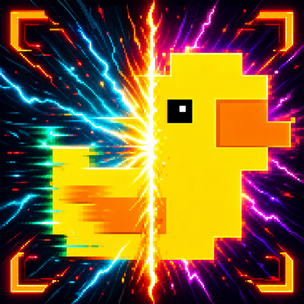

# Decky LSFG-VK Experimental

> [!IMPORTANT]
> ## This project has moved to [MAKO](https://github.com/eugeniosegala/MAKO)
>
> **Decky LSFG-VK Experimental and LSFG-VK Experimental are now continued and developed as [MAKO](https://github.com/eugeniosegala/MAKO).**
>
> This repository is archived and will no longer receive releases, support, documentation, or issue tracking.
>
> For the full announcement and background on the move, read:
>
> [MAKO: Frame Generation and more on SteamOS](https://www.reddit.com/r/SteamDeck/comments/1vrox2x/mako_frame_generation_and_more_on_steam_os/)
>
> ⭐ If you want to support the project and help me keep adding features, please [star MAKO](https://github.com/eugeniosegala/MAKO) and follow me on [GitHub](https://github.com/eugeniosegala).

<p align="center">
  
</p>

> **Experimental fork:** This independently developed fork of the original
> [Decky LSFG-VK](https://github.com/xXJSONDeruloXx/decky-lsfg-vk) plugin packages the fast-moving
> [lsfg-vk Experimental](https://github.com/eugeniosegala/lsfg-vk-experimental) engine for SteamOS, Bazzite, and
> other Decky Loader-compatible Linux systems. Test it per game; it is not an official release from Lossless Scaling
> or lsfg-vk.

> **Optional coexistence:** You can keep the public/original Decky LSFG-VK plugin installed. Choose exactly one
> launcher for each native Steam/Proton game: public `~/lsfg %command%` or experimental
> `~/.local/bin/lsfg-vk-experimental %command%`. Never combine them. Heroic and other Flatpak games are selected
> through this plugin's Flatpak setup.

## ✨ Experimental highlights

|    | Highlight                       | What it brings                                                                                                                                                                                                                                                                                        |
|:--:|---------------------------------|-------------------------------------------------------------------------------------------------------------------------------------------------------------------------------------------------------------------------------------------------------------------------------------------------------|
| 🖼️ | **Improved full-quality image** | In testing, v2 with **Performance Mode disabled** can show noticeably less ghosting than the older layer. Results remain game-dependent; Performance Mode is still useful when lower GPU overhead matters more than image quality.                                                                    |
| 🎯 | **Adaptive Frame Generation**   | Optionally target 30–240 FPS while the layer varies generated frames up to a selected 2x–4x ceiling. It is disabled by default while it continues to be refined.                                                                                                                                      |
| 🌈 | **HDR: in progress**            | The engine includes HDR10/PQ and linear-scRGB pipeline groundwork, but Decky keeps HDR exposure locked off while activation, presentation, colour, and performance are validated across games. |
| 🧩 | **64-bit and 32-bit Vulkan**     | Ships architecture-matched host and Flatpak layers. Vulkan selects the correct library for each game process, so genuine 32-bit Vulkan games no longer depend on the WoW64 workaround. |
| 🛡️ | **Gamescope recovery**          | Bounded presentation recovery preserves proven Adaptive state, ignores transient Steam-menu cadence, refreshes history, and resumes only after the game cadence is stable again. A validated 2x Adaptive setup also recovers from short gameplay hitches without entering the longer menu/focus path. |
| ⏯️ | **Live frame-generation switch** | Turn frame generation on or off immediately without changing the selected Fixed or Adaptive settings. Turn it back on to resume with the same profile.                                                                                                                                                |
| 🎮 | **Per-game Heroic support**     | Use the experimental layer only for the Heroic games you choose, with the same private configuration and engine as native Steam games.                                                                                                                                                                |

## What it is

This plugin installs a private, verified lsfg-vk v2 engine through its experimental launcher. It can remain installed
alongside the public/original plugin; use only one launcher per game.

HDR is still under development and disabled in Decky, so normal launches use the established SDR path. The plugin uses
the existing `Lossless.dll` installed by Lossless Scaling and never copies or modifies it.

For the exact engine version, checksum, and upstream changes, see [UPSTREAM_LSFGVK.md](UPSTREAM_LSFGVK.md). See the
[latest experimental release notes](https://github.com/eugeniosegala/decky-lsfg-vk-experimental/releases) for
build-specific known issues.

## 🎮 In-game considerations

> [!TIP]
> **Try the game's V-Sync setting both on and off.** It can make frame delivery feel steadier, but may also add input
> lag or clash with the game's FPS cap, VRR, or compositor. Every game is different: compare both options and keep the
> one that feels smoother and more responsive.

Every game, renderer, and display setup behaves differently. Compare Fixed and Adaptive Frame Generation one setting
at a time. For most games, fullscreen is the best starting point for performance and frame pacing. Restart after major
display or frame-generation changes, and keep the configuration that feels best for that game.

## Install and use

1. **Install Decky Loader** if needed: switch to Desktop Mode and follow the
   [official Decky Loader installation guide](https://github.com/SteamDeckHomebrew/decky-loader#-installation), then
   return to Game Mode.
2. **Install [Lossless Scaling](https://store.steampowered.com/app/993090/Lossless_Scaling/) from Steam.**
3. **Download the [latest version of the plugin](https://github.com/eugeniosegala/decky-lsfg-vk-experimental/releases/download/v0.13.0-experimental.25/Decky.LSFG-VK.Experimental-0.13.0-experimental.25.zip)**.
4. In Decky's settings cog, enable **Developer Mode**, then select **Developer > Install Plugin from Zip**.
5. Open this plugin and select **Install Experimental LSFG-VK (developer build)**. This required step installs the
   engine bundled in the ZIP into the plugin's private location.
6. Leave the defaults in place unless a game needs adjustment. Fixed 2x remains the default; Adaptive Frame Generation
   is optional.
7. For a native Steam/Proton game, add this to **Steam Properties > Launch Options**:

   ```text
   ~/.local/bin/lsfg-vk-experimental %command%
   ```

8. Start the game normally.

> [!IMPORTANT]
> If Decky does not show or reload the plugin after installing a ZIP, uninstall **this experimental plugin** from
> Decky, install the ZIP again, then restart your Steam Deck or Steam Machine. Afterwards, repeat step 5.

### Heroic and other Flatpak applications

The Steam launch wrapper cannot enter a Flatpak sandbox, so configure Heroic through **Flatpak Setup**:

1. Select **Flatpak Setup** in the plugin.
2. Under **Flatpak Applications**, prepare **Heroic**. If the matching runtime extension is missing, the message tells
   you which runtime to install, commonly **25.08**. Preparing Heroic grants access to the wrapper, configuration, and
   `Lossless.dll`; it does not enable frame generation for every Heroic game.
3. In every Heroic game you want to enable, open **Settings > Advanced** and set the first **Wrapper** field to:

   ```text
   /home/deck/.local/bin/lsfg-vk-experimental
   ```

   Leave **Arguments** empty. Do not use `%command%` in Heroic.
4. Start that game normally from Heroic or its Steam shortcut.

The wrapper applies only to the selected Heroic games. It enables the uniquely named experimental Flatpak layer and
disables both known public LSFG identities for that game. While HDR is locked off, its controlled SDR discovery keeps
Gamescope WSI ahead of the experimental layer; selection does not depend on ambiguous same-name search ordering.

> [!IMPORTANT]
> After installing a newer experimental plugin ZIP, return to **Flatpak Setup** and select **Update** for Heroic's
> matching runtime extension, commonly **25.08**. This replaces Heroic's Flatpak engine with the version bundled in
> the ZIP. Your Heroic preparation and per-game Wrapper commands remain in place.

### Updating

> [!IMPORTANT]
> **Preferred clean update:** To avoid Decky retaining a previous plugin backend or bundled payload, especially when
> moving between local test ZIPs, uninstall **this experimental plugin** from Decky, install the newer ZIP, restart your
> Steam Deck or Steam Machine, then open the plugin and select **Install Experimental LSFG-VK (developer build)**.

1. Quit games using the experimental wrapper.
2. Uninstall **this experimental plugin** from Decky, then install the newer ZIP through **Developer > Install Plugin
   from Zip**.
3. Restart your Steam Deck or Steam Machine.
4. Open the plugin and select **Install Experimental LSFG-VK (developer build)** to install the private native engine
   bundled in the ZIP.
5. If you use Heroic, open **Flatpak Setup** and select **Update** for Heroic's matching runtime extension, usually
   **25.08**. This updates its Flatpak engine without changing Heroic preparation or per-game Wrapper commands.

Profiles and Steam launch options are retained. The private native engine and launcher are re-created in step 4; shared
Flatpak extensions are retained, then refreshed in step 5. An in-place ZIP update still works in many cases, but use
the clean path above if Decky reports an archive error or fails to reload the plugin.

## Documentation

- [Configuration guide](docs/CONFIGURATION.md): fixed and Adaptive modes, quality/performance settings, profiles, and
  compatibility options.
- [Troubleshooting](docs/TROUBLESHOOTING.md): Gamescope recovery behaviour, HDR compatibility, and diagnostic logs.
- [Local packaging and publishing](docs/PACKAGING.md): build a ZIP for a Steam machine or publish a prerelease.
- [Upstream engine record](UPSTREAM_LSFGVK.md): pinned source, checksums, and carried changes.

## Featured In

Community creators have covered and tested this experimental plugin on Steam Deck hardware. See
[Featured In](docs/FEATURED_IN.md) for video links, channels, and coverage details.

## Credits

- **[Kurt Himebauch / xXJSONDeruloXx](https://github.com/xXJSONDeruloXx/decky-lsfg-vk)** for the original Decky LSFG-VK
  plugin on which this experimental fork is based
- **[PancakeTAS](https://github.com/PancakeTAS/lsfg-vk)** for creating the lsfg-vk Vulkan compatibility layer
- **[Lossless Scaling](https://store.steampowered.com/app/993090/Lossless_Scaling/)** developers for the original
  frame-generation technology
- **[Deck Wizard](https://www.youtube.com/@DeckWizard)** for community support, guides, testing, feedback, artwork, and
  tutorials
- The **Decky Loader** team and community contributors and testers

## AI-assisted development

This project uses coding agents as part of an evidence-driven engineering
workflow while keeping architecture, review, validation, and release decisions
under human ownership. See
[AI use in Decky LSFG-VK Experimental](AI_USE.md) for the full approach.
